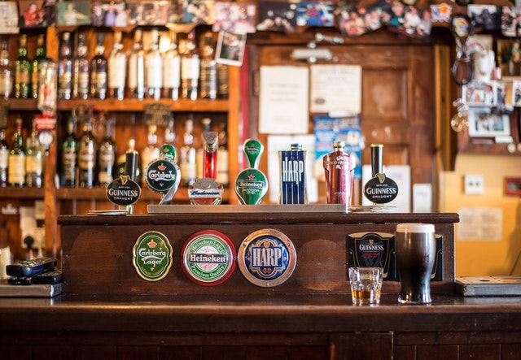

# [Beer Explorer](https://beer-explorer.auto200.eu)

### Aggregation of most popular beers in Poland

 

## How it works

Application is divided into two parts:

### Scraper

Gathers information about beers, (name, description, type etc.) from producers websites and combines it into single JSON file. It uses [Cheerio](https://www.npmjs.com/package/cheerio) for DOM traversing

### Frontend

Written in [NextJS](https://nextjs.org/), basically maps over JSON and generates static websites with provided data

---

#### These two apps are independent (do not need to work at the same time) For more info go to invidual directories

 

# For Educational Purposes Only
